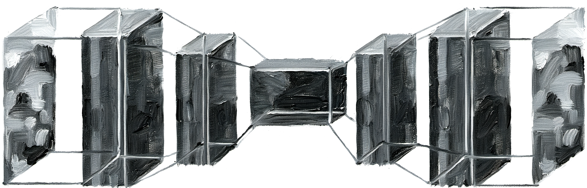

import { Image } from 'astro:assets';
import generativeAI from '../../assets/images/generative-ai.webp';
import ImageSequence from '../../components/ImageSequence.astro';

# Generative künstliche Intelligenz

Grundlagen zu Diffusionsmodellen, Stiltransfer und Finetuning

 

Unter Künstlicher Intelligenz (KI) versteht man in der Regel einen Sammelbegriff für
verschiedene Machine-Learning-Algorithmen. Dabei handelt es sich um Methoden
aus der Informatik, die vorrangig für Entscheidungen, Vorhersagen und Mustererkennung eingesetzt werden. Zu den bekanntesten Vertretern gehören sogenannte
neuronale Netze, die der Struktur des menschlichen Gehirns nachempfunden sind.
Ein künstliches neuronales Netz (KNN) besteht aus Knotenpunkten (analog zu Neuronen) und mehreren Ebenen, den sogenannten Layern. Generative KI, die komplexe
Inhalte wie Bilder, Videos oder Texte erzeugt, gehört zum Bereich des Deep Learning,
einer Methode, die auf mehrschichtigen neuronalen Netzwerken basiert (Stryker &
Kavlakoglu, 2024).

 

<Image src={generativeAI} alt="Generative AI" class="" />

Bildquelle: <a href="https://www.ibm.com/think/topics/artificial-intelligence">https://www.ibm.com/think/topics/artificial-intelligence</a>

 
## Diffusionsmodelle

  
Diffusionsmodelle wie Stable Diffusion sind KI-Verfahren, die von physikalischen Diffusionsprozessen inspiriert sind: Aus einem verrauschten Bild wird schrittweise wieder Struktur rekonstruiert. Zentrales Element ist ein U-Net, das Bildmerkmale von einfachen Kanten bis hin zu komplexen Objekten erkennt und das Rauschen zurückführt. 
  In meinem Fall verwende ich das Diffusionsmodell <a href="https://huggingface.co/stabilityai/stable-diffusion-xl-base-1.0">Stable Diffusion XL 1.0</a> verwenden.

  
   
  <Reference 
  title="IBM: Was sind Diffusion Models?" 
  type="website"
  authors="Bergman, D. & Stryker, C." 
  year="2024" 
  link="https://www.ibm.com/de-de/think/topics/diffusion-models" />
  

<ImageSequence folder="diffusion" mode="fade"/>

Bildquelle: [Laurent, Wikipedia](https://de.wikipedia.org/wiki/L%C3%B6we#/media/Datei:011_The_lion_king_Tryggve_in_the_Serengeti_National_Park_Photo_by_Giles_Laurent.jpg) Visualisierung eines Diffusionsprozesses von Rauschen zu einem neuen Bild im Ölmalstil

  

 

### Latenter Raum

  
Eingabebild

  
Ausgabebild

  

  Encoder
   

     

  Latenter Raum
   

        

  Decoder
   

  

 
Damit der Rechenaufwand nicht zu hoch wird, arbeitet das Modell nicht direkt auf Pixelbasis,
sondern in einem sogenannten latenten Raum. Dieser Raum ist eine komprimierte,
mathematische Darstellung der Bildmerkmale und wird mithilfe eines Variational Autoencoders
(VAE) erzeugt. Der VAE komprimiert das Bild in eine latente Repräsentation und
dekodiert es später wieder zurück in ein sichtbares Pixelbild.

## Neural Style Transfer

  

Der Stiltransfer ist eine Forschungsdisziplin neuronaler Netze, die den Stil eines Bildes auf den Inhalt eines anderen überträgt (Gatys et al., 2015). Er basiert auf der Trennung von Inhalt und Stil, die in verschiedenen Feature-Schichten des Netzwerks unterschieden werden: Niedrigere Schichten erfassen Farben, Kanten und Texturen, höhere Schichten semantische Inhalte und komplexe Strukturen. In der Forschung wird dies so interpretiert, dass Stil vor allem in den unteren, Inhalt in den oberen Schichten repräsentiert ist. Die saubere Entkopplung von Inhalt und Stil bleibt jedoch ein zentrales Problem des Stiltransfers (Porquet et al., 2025).

<Reference 
  title="A Neural Algorithm of Artistic Style" 
  type="paper"
  authors="Gatys, L. A., Ecker, A. S., & Bethge, M." 
  year="2015" 
  link="https://arxiv.org/abs/1508.06576" />

Bildquelle: [Laurent, Wikipedia](https://de.wikipedia.org/wiki/L%C3%B6we#/media/Datei:011_The_lion_king_Tryggve_in_the_Serengeti_National_Park_Photo_by_Giles_Laurent.jpg)

    
+

  

Bildquelle: [Vincent van Gogh, Sternennacht, Wikipedia](https://de.wikipedia.org/wiki/Sternennacht#/media/Datei:Van_Gogh_-_Starry_Night_-_Google_Art_Project.jpg)

  

    
=

  

Neuronaler Stiltransfer mit IP-Adapter

  

  

## Finetuned Models

### LoRA

  

Eine effiziente Form des Finetunings sind LoRAs (Low Rank Adaptation), mit denen
große KI-Modelle schnell auf spezifische Aufgaben angepasst und erweitert werden
können. LoRAs funktionieren ähnlich wie Adapter oder Erweiterungen. Dabei werden
die Gewichte und Parameter des vortrainierten Modells, beispielsweise von Stable
Diffusion XL, eingefroren und um eine „leichtgewichtige“ Zusatzstruktur in Form einer
Low-Rank-Matrix ergänzt. Die darin gespeicherten Gewichtungen enthalten kontextspezifische
Informationen, die erforderlich sind, um einen spezialisierten Anwendungsfall
abzubilden.

<a class="underline" href="https://huggingface.co/docs/diffusers/training/lora">Huggingface LoRA</a>

<Reference 
  title="LoRA: Low-Rank Adaptation of Large Language Models" 
  authors="Hu, E. J., Shen, Y., Wallis, P., Allen-Zhu, Z., Li, Y., Wang, S., ... & Chen, W." 
  year="2021" 
  link="https://arxiv.org/abs/2106.09685" />

<Reference 
  title="CivitAI" 
  type="website"
  authors="CivitAI" 
  year="2025" 
  link="https://civitai.com/"
  embed={true}
   />