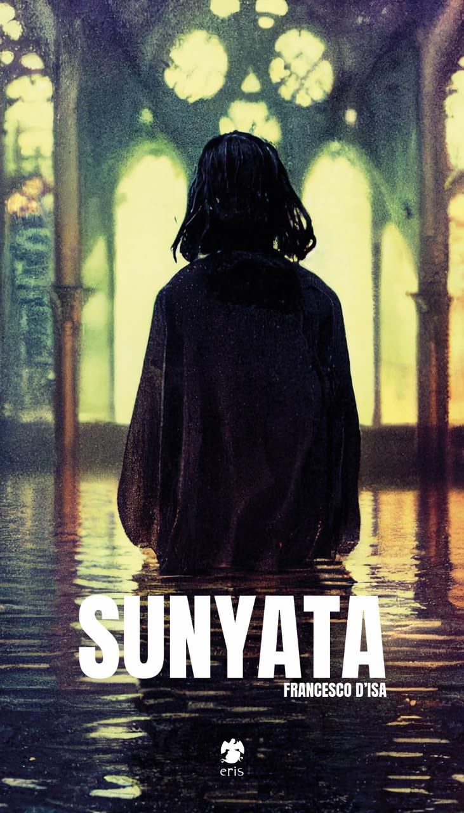

## Ermächtigung und "Demokratisierung"

  

Neben der Zeitersparnis und der Inspiration ist einer der Hauptgründe für die Verwendung von KI-Bildgeneratoren durch „nicht-professionelle“ Gestalter:innen die Ermächtigung und Vereinfachung (Tang et al., 2024, S. 4) – auch oft als Demokratisierung bezeichnet –, visuell Geschichten erzählen zu können, selbst wenn sie nicht über das zeichnerische oder malerische Handwerk verfügen. Stattdessen können sie ihre Ideen über Sprache mithilfe von Textprompts in Bilder übersetzen.

<Reference 
title="Exploring the Impact of AI-generated Image Tools on Professional and Non-professional Users in the Art and Design Fields" 
type="paper"
authors="Tang, Y., Zhang, N., Ciancia, M., & Wang, Z." 
year="2024"
link="https://doi.org/10.48550/arXiv.2406.10640" 
/>

In einem Interview mit dem Illustrator und Sprecher der Illustratoren-Organisation Jürgen Gawron wies er darauf hin, dass der Begriff „Demokratisierung“ bereits ein positiv geframtes Kampfwort ist, um KI-Gegenargumente zu entkräften. Nach seiner Aussage ist Illustration oder Textschreiben ein Handwerksberuf, den man erlernen kann (J. Gawron, eigenes Interview, 23. Juli 2025).
 

„Würde irgendjemand die Tatsache, dass man selbst keine Blomben legen kann oder Inlays in Zähne machen kann, als undemokratisch titulieren?“

- Jürgen Gawron, Illustrator

### Zarya of the Dawn

  

    
Die Graphic Novel Zarya of the Dawn, die von Kris Kashtanova geschrieben und veröffentlicht wurde,
      bezeichnet sie selbst als das erste „KI-assistierte“ Comicbuch (Kashtanova, 2025).
      Die Softwareentwicklerin und Fotografin hatte in der Zeit der Pandemie Fotomontagen vor Kunstwerken angefertigt,
      um ihre Einsamkeit und Isolation auszudrücken. Was zuvor sehr aufwendig war und mehrere Tage gedauert hatte, hat
      sie in Zarya of the Dawn mit Midjourney umgesetzt, um den kreativen Prozess zu beschleunigen und ihre Geschichte
      überhaupt erst visuell umsetzen zu können.
      Eines der Hauptargumente nach Kashtanova ist es, Menschen, die Ideen haben, aber nicht illustrieren können, die
      Möglichkeit zu geben, ihre Geschichten zu erzählen. Zum Beispiel nicht nur professionelle Künstler:innen, sondern
      auch Ärzt:innen, Lehrer:innen, Mütter und Wissenschaftler:innen (Kristina Kashtanova: "Creating Worlds With AI", Minute 13:50)
 

      <Video type="youtube" src="https://youtu.be/4j36HGbZLik?si=_N9KKf_u_kDacSxj&t=836" />

      Die US-amerikanische Urheberrechtsbehörde entschied in einem Urteil, dass die Geschichte und das Arrangement der
      Bilder, die Kashtanova in der Software Comic Life 3 angeordnet hatte, rechtlich geschützt sind. Nicht jedoch die
      einzelnen Illustrationen, die sie mit Midjourney generierte (Edwards, 2023)

  

  

    
    
Bildquelle: https://www.kris.art/portfolio-2/project-one-ephnc-jamy8

     
    <Reference title="Zarya of the Dawn" type="website" authors="Kashtanova, K." year="2025"
      link="https://www.kris.art/portfolio-2/project-one-ephnc-jamy8" />
  

### Cyberpunk Momotarō

  

 
  
Bildquelle: https://m.media-amazon.com/images/I/61+BssM-RkL.jpg

     
  

  

      
Der japanische Mangaka Rootport, der nach eigener Aussage nicht zeichnen kann, hat mit Cyberpunk: Momotarō den ersten vollständig KI-generierten Manga veröffentlicht. Mithilfe von Midjourney hat er rund 9000 Panels für 108 Seiten innerhalb von sechs Wochen illustriert. Die Graphic Novel erschien 2023 beim japanischen Verlag Shinchōsha (de Guzman, 2023).

       
          <Reference 
          title="Cyberpunk Momotarō – Could AI replace our favourite Mangaka?" 
          type="website"
          label="Link zum Artikel" 
          authors="" 
          year="2023"
      link="https://sabukaru.online/articles/cyberpunk-momotar-could-ai-replace-our-favourite-mangaka" />
  

## KI-Einsatz im "professionellen" Bereich

  

 Spätestens seit Duchamps Fountain und der Erklärung von Alltagsgegenständen zu „Readymades“ ist die Frage, was als Kunst gilt oder was künstlerische Qualität ausmacht, schwer zu beurteilen. Ob KI-Künstler:innen als Künstler:innen anerkannt werden und ob „Prompt-Engineering“ in diesen Bereich fällt, wird, wie etwa in McCormacks Paper Is Prompting Really Making Art?, kontrovers diskutiert (McCormack et al., 2023).
  

  <Reference 
  title="Is Prompting Really Making Art?"
  type="paper"
  authors="McCormack, J., Gambardella, C. C., Rajcic, N., Krol, S. J., Llano, M. T., & Yang, M."
  year="2023"     
  link="https://arxiv.org/abs/2301.13049" />

 
Im folgenden stelle ich Beispiele vor, bei denen die Künstler:innen KI Bildgeneratoren verwendet haben, obwohl sie selbst im professionellen künstlerischen Bereich bereits tätig sind.

### Wist

  

    
Der Schauspieler, Autor und Spieleentwickler Steven M. Robertson hat seine Graphic Novel Wist ebenfalls mit Midjourney erstellt, allerdings in einem hybriden Prozess. Dabei hat er die initialen Bilder aus Midjourney in Photoshop komponiert und editiert und anschließend in Clip Studio mit einem Grafiktablet übermalt. So konnte er feine Details in der Schattierung oder den Gesichtern anpassen. Das war für ihn der einzige Weg, um die Charaktere konsistent zu halten und gezielt markante Details in den generativen Bildern hinzuzufügen oder zu entfernen. Er selbst fordert laut eigener Aussage keine Rechte an den Bildern ein, sondern ausschließlich an der Geschichte (Robertson, 2025). 
Das Buch wurde überwiegend positiv bewertet und kletterte innerhalb weniger Wochen im Amazon-Bestsellerranking für das Genre „Horror Graphic Novels“ nach oben. In einem Interview gibt er an, dass er zunächst „aus Spaß“ als digitalen Comic angefangen habe, aber durch die große Nachfrage nach einer Printversion schließlich eine gedruckte Ausgabe realisierte. Da er kein Team hatte, ermöglichte ihm die Arbeit mit Midjourney, die Geschichte allein umzusetzen. Von der ersten Bildgenerierung bis zum fertigen Buch vergingen drei Monate (Lean, 2023).

     
    <Reference title="Wist" label="Link zur Webseite der Graphic Novel" authors="Robertson, S. M." year="2023"
      link="https://www.wistseries.com/" />

  

  

    
    
Bildquelle: https://drive.google.com/file/d/1UXKELW87ctRMoA0H0QccwwX5-gyaef4_/view

  

### Sunyata

  

    
    
Bildquelle: https://www.amazon.de/Sunyata-Kina-Francesco-DIsa/dp/B0CK9SRVG2/

     
    

  

Der Digitalkünstler und Philosoph Francesco D’Isa hat in seiner Graphic Novel Sunyata, die er mit KI entwickelt hat, die KI selbst als kollaboratives Medium verwendet. Dabei ist er ähnlich wie bei einer Tarotkartenlegung mit den generierten Bildern umgegangen, indem er die Ergebnisse reflektiert und interpretiert hat. Hier tritt er mit der KI in einen Dialog und hat eine Art „Gegenspieler“, mit der er gemeinsam die Geschichte lenkt und erzählt.
Anstatt zu versuchen, die KI zu kontrollieren, hat er die Unvorhersehbarkeit und „Fehler“ als erzählerisches Mittel verwendet. Diese begreift er im Sinne einer buddhistischen Zen-Lehre, die Ästhetik in der Imperfektion, der Gegenwärtigkeit und der Ungeplantheit sucht (Puliafito, 2024).
 
<Reference 
  title="Exploring Generative Art with Francesco D'Isa"   
  label="Interview mit Francesco D'Isa"
  authors="D'Isa, Francesco"
  year="2024"
  link="https://aimuse.substack.com/p/exploring-generative-art-with-francesco" /
  >
  

## KI Graphic Novels und Comics in der Forschung

 

  

    
In dem Paper Generating Coherent Comics with Rich Story Using ChatGPT and Stable Diffusion (Jin & Song, 2023) werden Gründe genannt, KI einzusetzen, etwa wenn Werke unvollendet bleiben oder Leser:innen das Ende eines bestimmten Comics nicht gefällt.

  

  

<Reference 
  title="Generating Coherent Comics with Rich Story Using ChatGPT and Stable Diffusion" 
  type="paper"
  authors="Ze Jin, Zorina Song"
  year="2023"
  link="https://arxiv.org/abs/2305.11067" />

  

### Kinky & Cosy

  

    <Reference 
  title="Comic Art Generation using GANs"
  type="download"   
  label="Link zur Masterarbeit"  
  authors="Verduyn, M."
  year="2022"
  link="https://www.nix.be/assets/pdf/Masterproef_MarnixVerduyn_KUL_MAI_2022.pdf" />
    

  

Einen ähnlichen Beweggrund für die Erstellung von Comics mithilfe von KI nennt der Comiczeichner und Computerwissenschaftler Marnix Verduyn, genannt Nix, der als Doktorand an der KU Leuven den Einsatz von künstlicher Intelligenz in der Comicgenerierung untersucht. In seiner Masterarbeit führt er das Beispiel von Gaston an. Als der belgische Autor und Zeichner André Franquin starb, beauftragte der Verlag Dupuis den kanadischen Comiczeichner Delaf (Marc Delafontaine), der drei Jahre lang den Stil Franquins studierte, um die Serie in einem nahezu identischen Stil fortzuführen. Verduyn stellt sich die Frage, ob es nicht auch mithilfe eines neuronalen Netzes möglich wäre, diesen Stil zu lernen (Verduyn, 2022b, S. 1).

  

